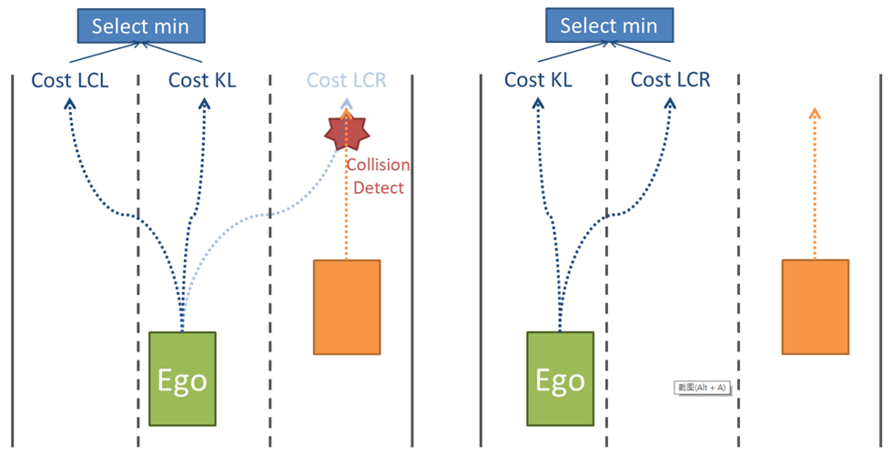

# CarND-Path-Planning-Project
Self-Driving Car Engineer Nanodegree Program
   
### Simulator and Project Informatin
See Udacity git of this project [here](https://github.com/udacity/CarND-Path-Planning-Project)

--
## [Rubric](https://review.udacity.com/#!/rubrics/1020/view)

1. The car is able to drive at least 4.32 miles without incident.
> Please build the code and run with simulator

2. The car drives according to the speed limit.
> I set a speed limit of 47.5 mph, which is declared as `SPEEDLIMIT` in codes. Speed up is conditioned on not exceeding the speed limit.

3. Max Acceleration and Jerk are not Exceeded.
> I used a spline curve to get a smooth trajectory. Also, velocity is add/sub at most 0.2 in a 0.02 second period, which means velocity has change rate (0.2/2.24)/0.02 = 4.46 meter/s^2.

4. Car does not have collisions.
> I detected the collisions between ego car's trajectory and other car's predicted trajectories. In addition, a cost function, `how_close_cost`, penalizes the trajectories that are too close to each other. Note that, when doing lane changing, I speed up ego-car if, at target lane, no car in front of us or the car in front of us is just far away. This makes a smooth lane changing.

5. The car stays in its lane, except for the time between changing lanes.
> There is a lane changing cost `change_lane_cost = 0.1`. So, lane-changing costs more than keep-lane state in same conditions.

6. The car is able to change lanes
> I used a `speed_efficiency_cost` to help selecting which path is more efficient. Ego-car changes lane if lane-changing produces a more efficient path than keep-lane (of course, no collision happens).

--
## More Details

As shown in the following figure, firstly, at most three possible trajectories are generated, then we select the one with smallest cost.



### Finite States

I use three states, "KL", "LCL", and "LCR". At each time stamp, three trajectories are produced according to these three states. Note that, if ego-car is at left most lane, then no path for "LCL" is produced. Similarly, path for "LCR" is not produced when car is at right most lane.

### Smooth Trajectory

A [cubic spline](http://kluge.in-chemnitz.de/opensource/spline/) is used for producing a smooth trajectory. Basically, I followed the codes that are showed in "Project Walkthrough and Q&A" with some modifications. To generate a new trajectory, a smaller number of previous points are reused (`num_reuse_prev_traj_pts`) than it is showed in Lecture. Smaller number of reusing points makes more new points to generate in order to quickly reflect the new environment. However, a non-smooth trajectory may be produced when it becomes to small. I found that `num_reuse_prev_traj_pts` set to 30 works well in my case.

Moreover, I produced 75 points for each trajectory (50 in Lecture) which represents 1.5 seconds for a path. A moderate long trajectory is helpful when using cost functions to compute trajectories for safety.

### Cost Functions

1. speed_efficiency_cost

Penalize slow speed for efficiency.


2. how_close_cost

Penalize close distance of two trajectories (for safety issue)

```c++
if (dist<=4.0)
 rtnCost = 1.0;
else
 rtnCost = pow((4.0/dist),2);
```


3. distance_factor

This factor is used together with `speed_cost` when calculating lane changing cost. The `speed_cost` represents the cost for "the car ahead of us" at **intended lane**, we call it "target car" for now.

`speed_cost *= dist_factor;` means if the target car is near to us, which means `factor` is near 1, then we keep the `speed_cost` value. On the other hand, if target car is far from us, then it is safe to change lane. Lower cost is calculated by multiplying a factor near 0.


* Cost in "KL"
```c++
// Calculate the cost
double speed_cost = speed_efficiency_cost(check_car_speed);
if (!isNear(aheadCarTrajectory_x, aheadCarTrajectory_y, rtn_next_x_vals, rtn_next_y_vals))
 speed_cost = 0;
double change_lane_cost = 0;
rtnCost = change_lane_cost + speed_cost;
return rtnCost;
```

* Cost in "LCL/LCR"
```c++
double speed_cost = speed_efficiency_cost(ahead_car_speed);
double dist_factor = 1.0;
if (carIdxAhead!=-1)  // far away from ahead car at intended lane, so we can descrease the speed_efficiency_cost by a factor
{
 double dist = EucledianDistBetweenTrajectories(aheadCarTrajectory_x, aheadCarTrajectory_y, rtn_next_x_vals, rtn_next_y_vals);
 dist_factor = 1.0 - 1.0/(1.0+exp((60.0-dist)*1.0));
}
speed_cost *= dist_factor;

double change_lane_cost = 0.10;  // a cost for changing lane, where KL costs 0
double how_close_behind_car_cost = 0.0;
if (behindCarTrajectory_x.size()!=0)  // having a behind car at intended lane
 how_close_behind_car_cost = how_close_cost(behindCarTrajectory_x,behindCarTrajectory_y,rtn_next_x_vals,rtn_next_y_vals);
double how_close_ahead_car_cost = 0.0;
if (aheadCarTrajectory_x.size()!=0)  // having a ahead car at intended lane
 how_close_ahead_car_cost = how_close_cost(aheadCarTrajectory_x,aheadCarTrajectory_y,rtn_next_x_vals,rtn_next_y_vals);
rtnCost = change_lane_cost + speed_cost;
rtnCost += (how_close_behind_car_cost<how_close_ahead_car_cost)?how_close_ahead_car_cost:how_close_behind_car_cost;  // chose max to add up
return rtnCost;
```
